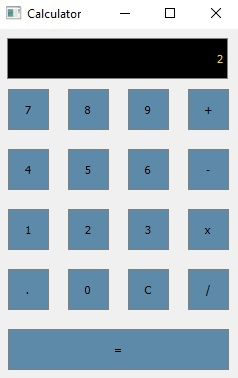

# Calc_SibGuti

Учебный проект. Цель: создать калькулятор совместными усилиями.

Приложение калькулятор написанный на C++ с использованием фреймворка Qt.

Используется веб-сервис для непрерывной интеграции Travis CI

  
